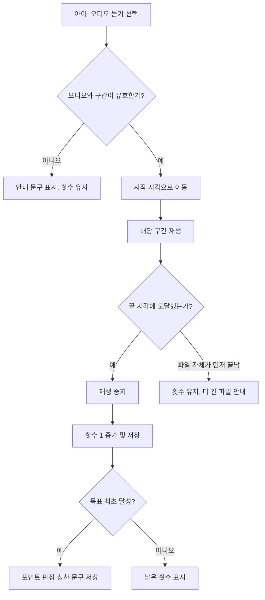
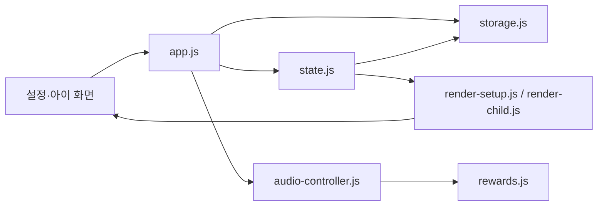

# 영어 집중듣기 학습표 v0.1 기능 명세와 v0.2 재구축 계획

작성일: 2026-07-26  
현재 앱 버전: `0.1`  
기준 구현: [`english-listening-homework.html`](../english-listening-homework.html)

## 문서 목적

이 문서는 현재 동작하는 v0.1을 정확히 보존하기 위한 기준 명세다. v0.2를 새 코드 구조로 만들 때 이 문서를 기능 계약으로 사용한다.

v0.2의 목표는 기능을 늘리는 것이 아니다. 보호자와 아이가 지금 쓰는 흐름, 저장된 학습 기록, MP3 사용 방식은 유지하면서 화면·상태·재생 로직을 분리해 안전하게 고칠 수 있는 코드 기반을 만드는 것이다.

## 1. 서비스 정의

영어 집중듣기 학습표는 보호자가 정한 MP3의 특정 구간을 아이가 반복해서 듣고, **구간 끝까지 실제 재생됐을 때만** 횟수를 자동 기록하는 가족용 주간 학습 웹앱이다.

계정, 서버, 외부 데이터베이스 없이 브라우저 안에서 동작한다. 설정과 학습 진도는 같은 브라우저에 저장하고, 선택적으로 MP3 파일도 그 기기에 저장해 다음 접속 때 자동 연결을 시도한다.

### 해결하는 문제

- 일반 플레이어에서 매번 구간 즐겨찾기를 찾고 재생하는 준비를 줄인다.
- 아이가 몇 번 들었는지 종이에 적거나 보호자가 확인해야 하는 부담을 줄인다.
- 평일 듣기와 주간 과제를 한 학습표에서 확인한다.
- 아이에게는 재생과 체크만 보이는 단순한 화면을 제공한다.
- 가정용 iPad Safari 환경에서 계정이나 DB 설정 없이 일주일 단위로 쓴다.

### 역할과 경계

| 역할 | 할 수 있는 일 | 보이지 않아야 하는 것 |
| --- | --- | --- |
| 보호자 | 오디오·구간·목표·과제·테마·문구·포인트·암호·백업 설정 | 없음 |
| 아이 | 정해진 구간 재생, 일시정지, 3초 되감기, 처음부터 다시 듣기, 주간 과제 체크 | 설정 입력, 백업, 새 주 초기화, 포인트 규칙 변경 |

암호는 아이 화면에서 설정으로 들어가는 일을 막는 가벼운 화면 잠금이다. 계정 인증이나 보안 경계는 아니다.

## 2. v0.1 사용자 기능 명세

### 2.1 설정 화면

설정 화면은 최초 실행 시 보이는 기본 화면이다. 핵심 설정은 세 개의 단계로 나뉜다.

#### 1) 오디오 설정

- MP3 및 브라우저가 지원하는 오디오 파일을 선택한다.
- `이 기기에 오디오 저장하기`를 켜면 파일 Blob을 IndexedDB에 저장한다.
- 파일을 선택한 뒤에는 `평일 듣기 설정` 영역에서 구간 확인용 미리듣기 플레이어가 나타난다.
- 미리듣기 플레이어는 브라우저 기본 재생 막대와 `현재 시간 / 전체 시간`을 보여 준다.
- MP3 선택 직후에는 현재 탭에서 바로 재생할 수 있다. 기기 저장 실패는 재생 자체를 막지 않으며, 다음 접속 때 다시 선택해야 할 수 있다는 상태 문구를 표시한다.

#### 2) 평일 듣기 설정

- 월요일부터 금요일까지 시작 시간, 끝 시간, 목표 횟수를 입력한다.
- 시작·끝 시간은 별도 입력 칸이며 `분:초` 형식이다. 예: `10:11`.
- 목표 횟수는 정수 `0` 이상이다.
- 목표가 `0`이면 구간 입력은 비워도 된다. 해당 요일은 학습 항목이 아닌 쉬는 날이다.
- 목표가 `1` 이상이면 유효한 시작·끝 시간이 필수다.
- 월요일의 시작 시간, 끝 시간, 목표 횟수를 화요일부터 금요일까지 복사하는 버튼이 있다.
- 구간 형식은 `10:11-10:20`과 `10:11–10:20`을 모두 허용한다. 끝 시간은 시작 시간보다 커야 한다.

#### 3) 주간 과제 설정

- 기본 과제는 영어 읽기 영상, 워크시트, 롤플레이 영상이다.
- 과제 이름을 바꿀 수 있다.
- 과제를 추가하거나 삭제할 수 있다.
- 최소 한 개의 과제는 남겨야 한다.

#### 추가 설정

추가 설정은 접힌 영역에 있다.

| 항목 | 현재 동작 |
| --- | --- |
| 테마 | 시나모롤, 라이트, 다크 중 하나를 선택하고 두 화면에 함께 적용한다. |
| 포인트 | 평일·주간 과제의 포인트와 마감 요일·시간을 지정한다. 0이면 관련 안내를 숨긴다. |
| 설정 암호 | 4자리 이상이면 아이 화면에서 설정 보기 전에 암호를 요구한다. |
| 화면 문구 | 제목, 안내, 진행률, 재생 버튼 등 아이 화면 문구를 바꾼다. `{remaining}`은 남은 횟수로 치환된다. |
| 칭찬 문구 | 한 줄에 하나씩 입력한다. 목표를 처음 달성할 때 한 문구를 무작위로 뽑아 저장한다. |
| 새 주 학습 시작 | 설정은 유지하고 이번 주 진도·포인트·체크만 초기화한다. |
| 설정·진도 백업 / 백업 복원 | JSON 파일로 현재 상태를 내보내거나 불러온다. |

### 2.2 아이 학습 화면

아이 화면은 입력 칸 없이 학습 카드만 보여 준다.

#### 카드와 진행률

- 월요일부터 금요일까지의 카드와 주간 과제 카드가 2열 격자로 표시된다. 작은 화면에서는 1열로 전환된다.
- 목표 횟수가 0인 평일은 `오늘은 쉬는 날` 카드로 보인다. 재생·포인트·완료 문구는 없다.
- 활성 평일 카드에는 `들은 횟수 / 목표 횟수`, 구간, 재생 버튼이 보인다.
- 기기 현지 날짜와 같은 요일에는 `오늘` 배지와 강조 테두리를 표시한다.
- 전체 진행률의 항목 수는 **목표가 1 이상인 평일 카드 수 + 주간 과제 수**다. 목표 0인 평일은 분모와 분자 모두에서 제외한다.
- 모든 활성 평일과 모든 주간 과제가 완료된 경우에만 주간 완주 배너를 표시한다. 학습 항목이 0개면 완주가 아니다.

#### 구간 재생과 횟수 증가



- 한 번에 하나의 요일 구간만 재생한다.
- 같은 카드의 재생 버튼은 재생 중 `일시정지`, 일시정지 상태에서 `계속 듣기`로 바뀐다.
- 재생 중인 카드에만 `↶ 3초 전`, `↺ 처음부터` 버튼이 나타난다.
- 3초 전은 구간 시작 이전으로 이동하지 않는다.
- 처음부터는 현재 구간의 시작 시각으로 이동한다.
- 되감기와 처음부터는 실제 재생 시간을 건너뛰지 않으므로 횟수 증가 규칙을 우회하지 않는다.
- 재생 버튼의 배경은 완료 횟수 비율을 평소에는 표시하고, 재생 중에는 현재 구간의 실제 시간 비율을 표시한다.
- 종료 시각 도달은 `timeupdate`와 약 60ms 주기의 확인 타이머로 감시한다.
- 파일이 종료 시각보다 먼저 끝나면 횟수를 증가시키지 않는다.
- 목표를 채운 카드에서는 재생 버튼 대신 저장된 칭찬 문구를 보인다.

#### 주간 과제, 포인트, 칭찬

- 주간 과제는 체크박스만 제공한다.
- 마지막 주간 과제를 처음 체크한 시점에만 주간 포인트를 판정한다.
- 평일 포인트는 해당 요일에, 지정한 마감 시간 전 목표를 처음 달성한 경우에만 적립한다.
- 주간 과제 포인트는 월요일부터 선택한 마감 요일·시간 전 모두 완료했을 때 적립한다. 일요일 마감은 월요일부터 토요일 전체와 일요일 마감 시각 전까지를 허용한다.
- 포인트가 0이면 포인트 합계와 조건 문구를 숨긴다.
- 평일 목표를 처음 달성하면 칭찬 문구 목록에서 하나를 무작위로 뽑고 카드에 저장한다. 새로고침해도 바뀌지 않는다.

### 2.3 테마와 홈 화면

| 테마 | 식별자 | 특징 |
| --- | --- | --- |
| 구름 위 학습표 | `cinnamoroll` | 하늘색, 시나모롤 배경과 완주 이미지, 둥근 카드 |
| 조용한 집중 노트 | `light` | 아이보리 표면, 네이비 버튼, 차분한 노트 톤 |
| 오늘의 미션 보드 | `dark` | 짙은 남색 표면, 민트 강조색, 어두운 환경용 |

- 테마는 설정과 아이 화면에 함께 적용된다.
- `manifest.webmanifest`, Apple Touch Icon, 512px 아이콘을 포함한다.
- 홈 화면 추가 후 시작 주소는 `english-listening-homework.html`이다.
- `index.html`은 핵심 파일로 이동시키는 진입 페이지다.

## 3. 데이터와 브라우저 저장

### 3.1 상태 모델

`localStorage`의 키는 `englishListeningHomeworkV1`이다.

```js
{
  screen: 'setup' | 'child',
  theme: 'cinnamoroll' | 'light' | 'dark',
  days: [{
    name: '월요일',
    segment: '10:11-10:20',
    target: '3',
    count: 1,
    points: 200,
    completedAt: '2026-07-26T09:00:00.000Z',
    celebration: '🎉 오늘 목표 달성! 정말 멋져!'
  }],
  tasks: ['영어 읽기 영상 찍기'],
  taskDone: [false],
  completeMessages: ['칭찬 문구'],
  rewards: {
    dailyPoints: 200,
    dailyDeadline: '18:00',
    weeklyPoints: 500,
    weeklyDeadlineDay: 6,
    weeklyDeadline: '12:00',
    weeklyEarned: 0,
    weeklyCompletedAt: ''
  },
  parentPassword: '',
  texts: { /* 아이 화면 문구 */ },
  audio: { name: '파일명.mp3', saveToDevice: true }
}
```

`normalizeState()`는 이전에 저장된 상태의 누락 필드를 기본값으로 채우고, 과거 기본 문구를 현재 기본 문구로 옮긴다. 이 마이그레이션은 v0.1 내부의 누적 변경을 흡수하는 호환 계층이다.

### 3.2 MP3 저장

| 데이터 | 위치 | 내용 | 한계 |
| --- | --- | --- | --- |
| 설정·진도 | localStorage | 상태 JSON | 같은 브라우저·같은 주소에서만 자동 유지 |
| 선택한 MP3 | IndexedDB `englishListeningHomeworkAudioV1` | Blob과 파일명 | Safari 웹사이트 데이터 삭제·다른 기기에서는 자동 복원 불가 |
| 현재 탭 재생 주소 | 메모리 | `URL.createObjectURL()` 결과 | 새로고침 후 사라짐 |

웹페이지는 Files의 실제 MP3 경로를 저장하거나 자동으로 다시 선택할 수 없다. 백업에는 파일명만 포함하며 MP3 파일 자체는 포함하지 않는다.

### 3.3 JSON 백업

- 백업은 설정 화면에서만 제공한다.
- 파일 이름 형식은 `영어듣기-엄마설정-YYYY-MM-DD_HH-MM-SS.json`이다.
- 백업의 `version: 1`은 **백업 스키마 버전**이다. 앱 화면의 `APP_VERSION: '0.1'`과 별개다.
- `appVersion` 필드는 백업을 만든 앱 버전으로, 현재는 `0.1`이다.
- 복원은 앱 이름과 백업 스키마 버전이 맞는지 검사한 뒤 설정 화면으로 이동한다.
- 복원 뒤에는 MP3를 다시 선택해야 할 수 있다.

### 3.4 새 주 학습 시작

초기화하는 값:

- 모든 평일의 `count`, `points`, `completedAt`, `celebration`
- 모든 `taskDone`
- `weeklyEarned`, `weeklyCompletedAt`

유지하는 값:

- 구간, 목표, 주간 과제 이름
- 테마, 문구, 칭찬 문구, 포인트 규칙, 설정 암호
- 오디오 파일명과 기기 저장 설정

## 4. 오류와 제한 사항

| 상황 | 현재 처리 | 사용자에게 필요한 행동 |
| --- | --- | --- |
| MP3 없음 | 아이 화면에 파일 재선택 UI 표시 | MP3 선택 |
| 구간 형식 오류 | 설정 화면에 오류 표시 | `분:초-분:초`로 수정 |
| 목표가 1 이상인데 구간 없음 | 설정 저장 거부 | 시작·끝 시간 입력 |
| MP3가 구간 끝보다 짧음 | 횟수 유지, 더 긴 파일 안내 | 올바른 MP3 선택 |
| 재생 권한·파일 문제 | 재생 실패 안내 | MP3 다시 선택 |
| IndexedDB 저장 실패 | 현재 재생은 유지, 기기 저장 해제 | 다음 접속에서 다시 선택 |
| 예기치 않은 JavaScript 오류 | 오류 화면과 설정 초기화 버튼 표시 | 초기화 후 다시 설정 |
| 암호 불일치 | 설정 진입 거부 | 올바른 암호 입력 |

알려진 구조적 한계:

- 기기 시간을 바꾸면 포인트의 마감 시간 판정을 바꿀 수 있다.
- 설정 암호는 localStorage에 저장되므로 실제 보안 수단이 아니다.
- 다른 iPad나 다른 Safari 프로필로는 진도가 자동 동기화되지 않는다.
- 서비스 워커가 없으므로 네트워크가 완전히 끊긴 환경의 새로고침 동작을 보장하지 않는다.

## 5. 현재 코드 구조와 품질 기준

### 파일 구성

| 파일 | 역할 |
| --- | --- |
| `english-listening-homework.html` | HTML, CSS, JavaScript 전체를 가진 v0.1 앱 |
| `index.html` | 핵심 앱 파일로 이동 |
| `manifest.webmanifest` | 홈 화면 웹앱 메타데이터 |
| `assets/` | 테마 배경, 완주 이미지, 홈 화면 아이콘 |
| `tests/learning-state.test.mjs` | 학습 항목·진행률·새 주 초기화 규칙 단위 테스트 |
| `QA_TEST_PLAN.md` | 브라우저와 iPad Safari 수동 점검 계획 |

### 현재 코드의 장점

- 배포·열기·수정이 단순하다.
- 외부 의존성과 서버가 없다.
- 실제 오디오 완료 뒤 횟수 증가라는 핵심 규칙이 명확하다.
- 오래된 저장 상태를 보정하는 코드가 있다.
- 중요한 진행률·새 주 초기화 규칙은 자동 테스트로 보호한다.

### v0.2에서 해결할 유지보수 문제

- 한 HTML 파일의 JavaScript가 상태, DOM 렌더링, 오디오 제어, 저장, 백업, 이벤트 연결을 동시에 담당한다.
- 기능마다 문자열 템플릿과 이벤트 리스너가 길어져 작은 수정도 영향 범위를 찾기 어렵다.
- CSS가 기능 추가와 디자인 실험을 거치며 덮어쓰기 규칙이 여러 곳에 쌓였다.
- 오디오 재생, 보상 판정, 저장 마이그레이션의 경계를 단위 테스트로 직접 검증하기 어렵다.
- 앱 버전과 데이터/백업 스키마 버전이 개념적으로 구분돼 있지만, 중앙 정의와 변경 기록이 더 필요하다.

## 6. v0.2 재구축 원칙

1. **사용 흐름은 보존한다.** 아이의 재생 화면과 보호자의 설정 흐름을 갑자기 바꾸지 않는다.
2. **서버를 추가하지 않는다.** localStorage, IndexedDB, JSON 백업, GitHub Pages를 유지한다.
3. **기존 기록을 먼저 옮긴다.** v0.1 상태를 읽고 검증한 뒤 v0.2 상태로 한 번만 마이그레이션한다.
4. **오디오 완료 규칙을 가장 강하게 보호한다.** 끝 시각 도달 전에는 횟수가 절대 증가하지 않아야 한다.
5. **테마는 표현만 바꾼다.** 정보 구조와 버튼 위치, 의미 있는 색상 역할은 모든 테마에서 같다.
6. **배포 전 병렬 검증한다.** 기존 v0.1을 지우지 않고 v0.2를 별도 경로에서 확인한 뒤 교체한다.

## 7. 권장 v0.2 구조

v0.2는 정적 사이트로 유지하되, 브라우저가 그대로 읽을 수 있는 ES 모듈 파일로 나눈다. 별도 서버나 복잡한 빌드 도구는 필요 없다.

```text
v0.2/
├─ index.html                 # 앱 진입, 화면 뼈대
├─ styles/
│  ├─ tokens.css              # 색상·여백·글자 크기·테마 변수
│  ├─ layout.css              # 카드·그리드·반응형 규칙
│  └─ components.css          # 버튼·입력·모달·상태 표현
├─ scripts/
│  ├─ app.js                  # 초기화, 화면 전환, 이벤트 조합
│  ├─ constants.js            # APP_VERSION, 데이터 스키마, 기본값
│  ├─ state.js                # 상태 생성·검증·마이그레이션·주간 초기화
│  ├─ storage.js              # localStorage, IndexedDB, JSON 백업
│  ├─ audio-controller.js     # 구간 재생, 일시정지, 되감기, 완료 판정
│  ├─ rewards.js              # 마감 판정, 포인트, 칭찬 문구 선택
│  ├─ render-setup.js         # 설정 화면 렌더링
│  ├─ render-child.js         # 아이 화면 렌더링
│  └─ format.js               # 시간·문구·HTML 이스케이프
├─ assets/
└─ tests/
```



### 모듈 책임

| 모듈 | 책임 | 하지 않아야 할 일 |
| --- | --- | --- |
| `state.js` | 상태 생성, 유효성 검사, v0.1→v0.2 마이그레이션, 진행률, 새 주 초기화 | DOM 접근, 오디오 재생 |
| `storage.js` | localStorage, IndexedDB, JSON 내보내기·가져오기 | 포인트 계산, 화면 문구 결정 |
| `audio-controller.js` | 시작·끝 시각 감시, 재생·일시정지·되감기·처음부터, 완료 이벤트 | 카드 HTML 생성, localStorage 직접 호출 |
| `rewards.js` | 기기 시간 기준 마감 판정, 적립·칭찬 선택 | 오디오 API 호출 |
| 렌더 모듈 | 상태를 화면으로 표현하고 접근성 속성 제공 | 비즈니스 규칙 계산 |
| `app.js` | 모듈 연결, 사용자 이벤트 처리, 저장과 재렌더 순서 조정 | 개별 규칙을 중복 구현 |

## 8. v0.1에서 v0.2로의 데이터 전환

### 키와 스키마 분리

| 개념 | v0.1 | v0.2 권장 |
| --- | --- | --- |
| 화면 버전 | `APP_VERSION = '0.1'` | `APP_VERSION = '0.2'` 이후 패치마다 `0.2.1` |
| 앱 상태 키 | `englishListeningHomeworkV1` | `englishListeningHomeworkV2` |
| 상태 스키마 | 암묵적 | `stateSchemaVersion: 2` 명시 |
| 오디오 DB | `englishListeningHomeworkAudioV1` | 기존 DB를 읽어 v2 DB로 복사하거나, 검증 후 유지 |
| 백업 스키마 | `version: 1` | `backupSchemaVersion: 2`로 명시하고 v1도 가져오기 지원 |

### 마이그레이션 순서

1. v0.2 시작 시 v2 상태 키를 먼저 찾는다.
2. v2 상태가 없으면 v0.1 상태 키를 읽는다.
3. `days`, `tasks`, `taskDone`, `rewards`, `texts`, `audio`의 타입과 길이를 검증한다.
4. 유효하면 v2 상태 구조로 변환하고 새 키에 저장한다.
5. 기존 v0.1 키는 바로 삭제하지 않는다. v0.2에서 정상 렌더와 저장이 확인된 뒤, 별도 `이전 데이터 정리` 동작으로만 지운다.
6. 변환에 실패하면 기존 v0.1 데이터는 건드리지 않고 오류 화면에서 JSON 백업 또는 초기화를 안내한다.

### 호환성 완료 조건

- v0.1의 설정, 평일 횟수, 과제 체크, 포인트, 완료 문구, 테마, 암호가 v0.2에서 동일하게 보인다.
- v0.1에서 기기 저장한 MP3를 v0.2가 찾지 못하는 경우에도 원래 상태를 지우지 않고 파일 재선택만 요청한다.
- v0.1 백업 JSON을 v0.2에서 가져올 수 있다.
- v0.2 백업에는 앱 버전과 백업 스키마 버전을 분리해 기록한다.

## 9. v0.2 구현 단계와 검증

### 단계 1: 기준 고정

- 이 문서를 기준으로 핵심 기능 목록과 수용 기준을 고정한다.
- v0.1 JSON 예시를 익명 테스트 픽스처로 만든다.
- 현재 자동 테스트를 유지하고 부족한 규칙 테스트를 추가한다.

### 단계 2: 순수 규칙 모듈화

- 시간·구간 파싱, 활성 학습 항목, 진행률, 새 주 초기화, 마감 판정, 포인트 판정을 DOM 없이 테스트한다.
- 목표 0, 일요일 마감, 파일 조기 종료, 목표 최초 달성, 이미 완료한 카드, 빈 과제 목록을 검증한다.

### 단계 3: 저장소와 마이그레이션

- localStorage와 IndexedDB 어댑터를 만든다.
- v0.1 상태와 v1 백업을 가져오는 마이그레이션 테스트를 만든다.
- 저장 실패, 깨진 JSON, IndexedDB 실패 시 기존 상태 보존을 검증한다.

### 단계 4: 오디오 제어기

- `HTMLAudioElement`를 감싼 제어기를 만든다.
- 재생 시작, 일시정지/재개, 3초 전, 처음부터, 구간 종료, 파일 조기 종료를 이벤트로 분리한다.
- 완료 이벤트는 한 재생 시도당 한 번만 발생해야 한다.

### 단계 5: 화면과 테마

- 설정 화면과 아이 화면을 독립 렌더 함수로 만든다.
- 공통 디자인 토큰을 세 테마에 적용한다.
- 44px 터치 영역, 2열/1열 전환, 화면 읽기 도구 상태 문구를 점검한다.

### 단계 6: 병렬 공개 전 검증

- v0.2를 별도 경로로 열고 v0.1과 나란히 비교한다.
- iPad Safari에서 MP3 선택, 기기 저장, 새 접속 자동 복원, 재생 완료, 백업·복원을 실제로 확인한다.
- 보호자가 설정 화면에서 한 주를 구성하고, 아이가 독립적으로 학습을 마칠 수 있는지 확인한다.
- 사용자가 로컬 결과를 승인한 뒤에만 GitHub Pages 기본 페이지를 v0.2로 바꾼다.

### 필수 테스트 표

| 영역 | 자동 테스트 | iPad Safari 수동 테스트 |
| --- | --- | --- |
| 구간 파싱 | 하이픈·엔대시·잘못된 초·역순 시간 | 미리듣기로 실제 시간을 보고 입력 |
| 재생 완료 | 끝 시각 전에는 횟수 불변, 종료 시 정확히 1 증가 | 실제 MP3로 확인 |
| 제어 버튼 | 일시정지, 재개, 3초 전 하한, 처음부터 | 버튼 터치 영역과 상태 문구 |
| 저장 | 상태 직렬화·마이그레이션·백업 호환 | Safari 재실행·기기 저장 복원 |
| 보상 | 요일·마감 시간·일요일 규칙 | 기기 현지 시간 기준 확인 |
| 화면 | 목표 0, 빈 진행률, 완료 문구, 테마 | 2열·1열 레이아웃, 홈 화면 실행 |
| 오류 | 파일 없음, 짧은 파일, 깨진 백업 | 오류 화면이 빈 화면을 대체하는지 |

## 10. v0.2에서 의도적으로 하지 않는 일

- 로그인, 사용자 계정, 여러 가족 프로필
- 서버 동기화 또는 MP3 서버 업로드
- Files 실제 경로 자동 저장·자동 선택
- 포인트를 변조 불가능한 보상 화폐로 만들기
- 아이 활동을 감시하는 분석 기능

이 항목들은 새로운 개인정보, 보안, 저작권, 운영 문제를 만들기 때문에 현재의 가족용 정적 앱 재구축 범위와 분리한다.

## 11. 다음 구현 시작 전 결정할 항목

1. v0.2를 여러 정적 파일로 유지할지, 최종 배포 시 다시 단일 HTML로 묶을지 결정한다. 권장은 여러 정적 파일이다. GitHub Pages와 iPad Safari에서 그대로 동작하며 유지보수가 훨씬 쉽다.
2. v0.1을 계속 기본 주소로 둘지, `v0.2/`에서 충분히 사용해 본 뒤 바꿀지 결정한다. 권장은 병렬 경로 검증 후 교체다.
3. v0.1 상태를 성공적으로 옮긴 뒤에도 원본 상태 키를 남길 기간을 정한다. 권장은 최소 한 번의 새 주 시작과 백업·복원을 마칠 때까지 유지다.

## 관련 문서

- [현재 서비스 개요](../SERVICE_OVERVIEW.md)
- [디자인 및 제품 판단](../OFFICE_HOURS_DESIGN.md)
- [QA 테스트 계획](../QA_TEST_PLAN.md)
- [학습 상태 단위 테스트](../tests/learning-state.test.mjs)
